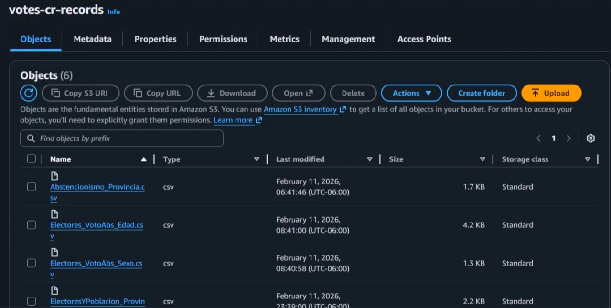
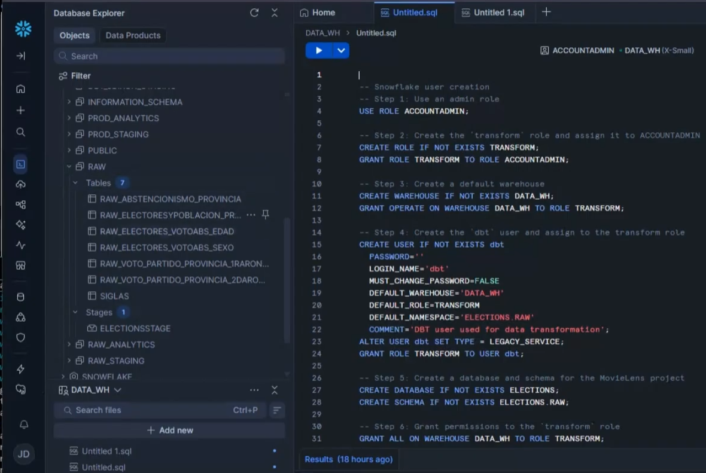
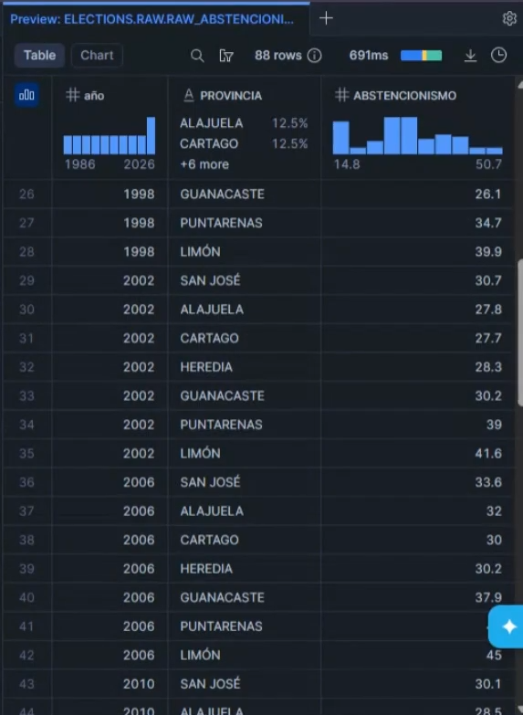
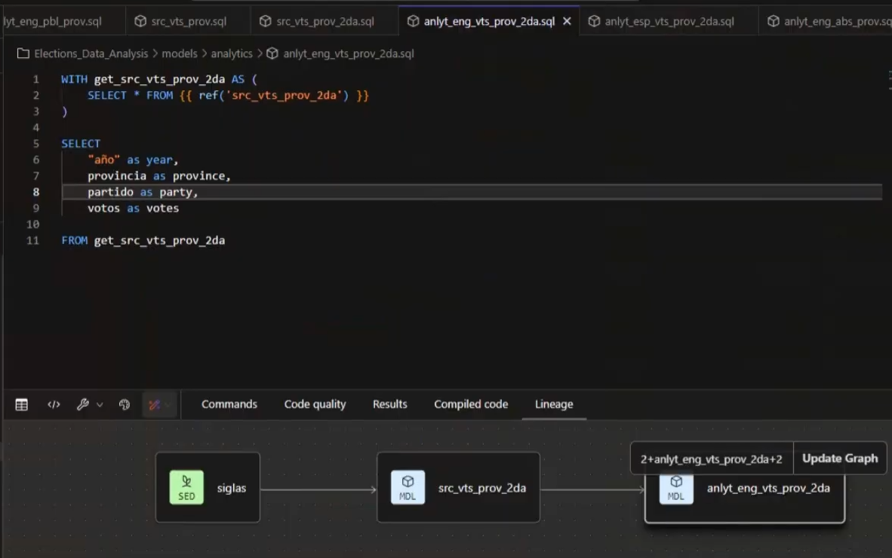
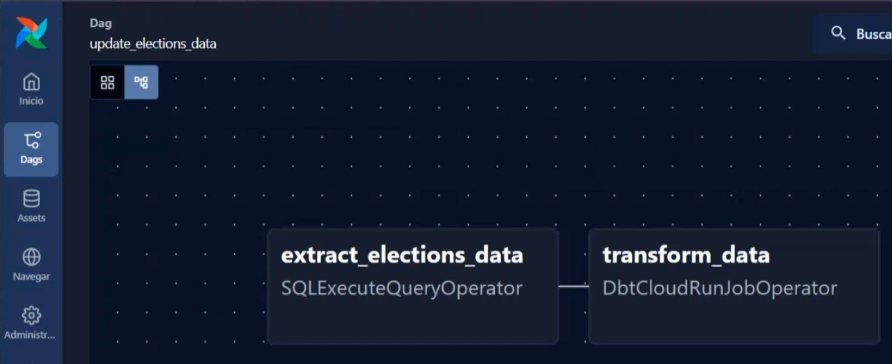

# Elections_ELT_Project

---
## Technology Stack
- **Dashboard:** Tableau
- **Data Lake:** AWS, S3, (RAW .CSV)
- **Data WareHouse:** Snowflake
- **Data Transformation:** DBT
- **Data Pipe Line:** Airflow

---

## ELT project about historical elections in Costa Rica 1986-2026:
- **Tableau:** [Dashboard](https://public.tableau.com/views/Elections_17708764490170/AnlisisHistricoEleccionesPresidencialesenCostaRica1986-2026?:language=en-US&:sid=&:redirect=auth&:display_count=n&:origin=viz_share_link)
- **ELT process:** [Explanation Video](https://youtu.be/wEnZ9-dnWtU?si=p0E0ZRGukBEbL9Zx)

---

## Evidence

